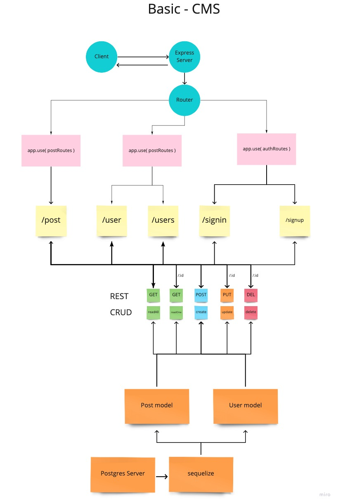

<h1 align="center">Welcome to basic-cms-api 👋</h1>
<p>
  
  <a href="https://github.com/basic-cms/basic-cms-api#readme" target="_blank">
    
  </a>
  <a href="https://github.com/basic-cms/basic-cms-api/graphs/commit-activity" target="_blank">
    
  </a>
  <a href="https://github.com/basic-cms/basic-cms-api/blob/master/LICENSE" target="_blank">
    
  </a>
</p>

> Basic Content Management System (CMS) API

### [GitHub](https://github.com/basic-cms/basic-cms-api#readme)

### [Production](https://basic-cms-api-prod.herokuapp.com/)
### [Development](https://basic-cms-api-dev.herokuapp.com/)

## Install

```sh
npm install
```

## Usage

```sh
npm run dev
```

## Run tests

```sh
npm run test
```

## UML



## Routes

```sh
  auth:

    POST /signup
    POST /signin
    
  post:

    GET /posts
    GET /posts/:userId
    GET /post/:id
    POST /post
    PUT /post/:id
    DEL /post/:id

  user:

    GET /user
    GET /users
    DEL /user
```


## Author

👤 **MuckT, Antoni909**

* Github: [@basic-cms](https://github.com/basic-cms)

## 🤝 Contributing

Contributions, issues and feature requests are welcome!<br />Feel free to check [issues page](https://github.com/basic-cms/basic-cms-api/issues). You can also take a look at the [contributing guide](https://github.com/basic-cms/basic-cms-api/blob/master/CONTRIBUTING.md).

## Show your support

Give a ⭐️ if this project helped you!

## 📝 License

Copyright © 2021 [MuckT, Antoni909](https://github.com/basic-cms).<br />
This project is [MIT](https://github.com/basic-cms/basic-cms-api/blob/master/LICENSE) licensed.

***
_This README was generated with ❤️ by [readme-md-generator](https://github.com/kefranabg/readme-md-generator)_
